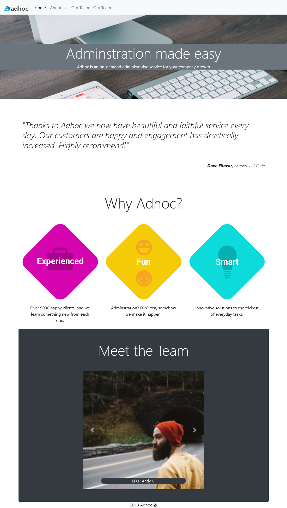

# Adhoc Website
 Practice Project - Codeacdemy
# Adopt a Pet

This is a Practice Project for Codecademy Front End Developer Course. 
A website for the fictional Adminstration Company Adhoc.

## Table of contents

- [Overview](#overview)
  - [Screenshot](#screenshot)
  - [Links](#links)
- [My process](#my-process)
  - [Built with](#built-with)
  - [What I learned](#what-i-learned)
  - [Continued development](#continued-development)
  - [Useful resources](#useful-resources)
- [Author](#author)

## Overview

### Screenshot

### Links

- Live Site URL: (https://covid19-tracker-67.netlify.app/)

## My process

### Built with

- Semantic HTML5 markup
- CSS custom properties
- Flexbox
- CSS Grid
- Responsive Design
- [Bootstrap](https://reactjs.org/) - Bootstrap
- 

### What I learned

I learned how to use Bootstrap Components.

## Author

- Website - [Add your name here](https://www.your-site.com)
- Frontend Mentor - [@yourusername](https://www.frontendmentor.io/profile/yourusername)
- Twitter - [@yourusername](https://www.twitter.com/yourusername)
